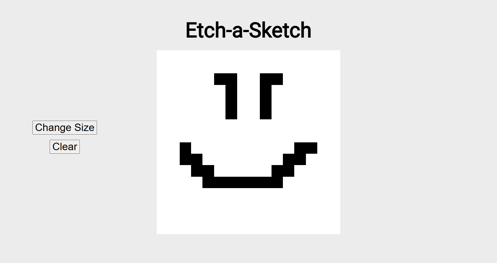

# Etch-a-Sketch Browser Application

A basic browser Etch-a-Sketch application that allows variable grid sizing.

Built as part of [The Odin Project](https://www.theodinproject.com/) curriculum to practice **Flexbox** and **DOM manipulation**.

## Features

- Drawing on a sketchpad
- Clearing your drawing
- Changing the size of the board to between 1-64 pixels

## Demo

### [Live Demo](https://songzhang015.github.io/project-4-etch-a-sketch/)

## Built Using

- HTML
- CSS
- Javascript
